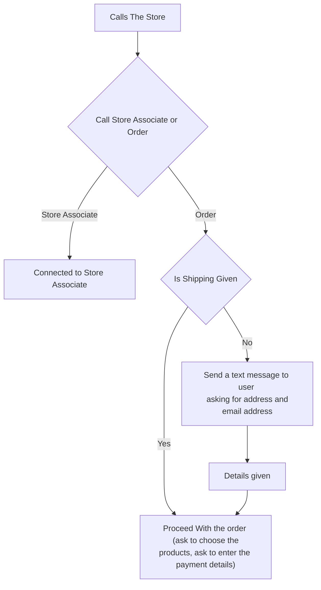

# Medu Caller - Order From Medusa Store via a Call


## About

### Participants

Osada Vidath - @osadavc - Osada#9999

### Description

Medu caller is a simple way to allow people to order from a Medusa store via a call. It uses the Medusa API to interact with the Medusa instance and the Twilio API to make the calls. With this people can call the number, choose the item that they want to buy, enter their card details via twilio, stripe integration and place the order. Although this can support stores with a large number of products it is recommended and meant to be used in stores with small number of products (branded single product stores, merchandise stores)

### Preview

Here is a preview of the the call function in action. I am using textnow here to call the twilio number toll-free but you could use your mobile phone to call.


### Flow of Calls

Here is the basic flow of calls, watch the above recording to understand it more clearly.



## Set up Project

### Prerequisites

- Medusa store up and running ([Quick Start](https://docs.medusajs.com/quickstart/quick-start)) Store should have a database running other than SQLite
- Stripe account ([Sign Up](https://stripe.com/))
- Twilio Account ([Sign up](https://www.twilio.com/try-twilio))

### Install Project

1. Setup a Medusa Store ([Quick Start](https://docs.medusajs.com/quickstart/quick-start))

2. Create a twilio account and activate the trial. You will need to get the phone number, account SID and auth token from the dashboard.

3. Connect twilio with stripe to get the payments. ([Instructions](https://www.twilio.com/docs/voice/tutorials/how-capture-your-first-payment-using-pay))

4. Setup a SQL Database outside of the Medusa database to store caller information. (Postgres preferred)

5. Create a medusa admin API key. ([Documentation](https://docs.medusajs.com/api/admin/))

6. Clone the repository

```bash
git clone https://github.com/osadavc/medu-caller.git
```

7. Change directory and install dependencies:

```bash
cd medu-caller
npm install
```

8. Replace values in `.env.local` and `src/config.ts` files with the real values.

- `DATABASE_URL` is the database where information about the callers and temporary information will be stored. This must be a different database than Medusa database

- `CALLER_URL` in the `config.ts` file should be the place where this project is running. This must be a SSL URL. (you can use ngrok for testing purposes)

- `CUSTOMER_SERVICE_NUMBER` in the `config.ts` is the number that the caller would be connected if they asked for customer support

9. Start the server (You might want to host in a server or start a ngrok tunnel.)

```base
npm run dev
```

10. Enter the URL of the server in the twilio dashboard for webhooks when calling and messaging.
    eg:

    

## Resources

To extend this even more, you can read the twilio documentation and the Medusa documentation.

- [Medusa Store API Documentation](https://docs.medusajs.com/api/store/)
- [Medusa Admin API Documentation](https://docs.medusajs.com/api/admin/)
- [Twilio Documentation](https://www.twilio.com/docs)
